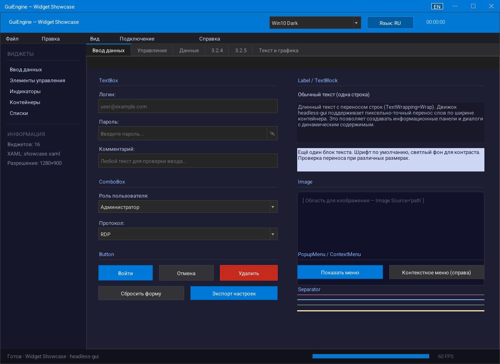
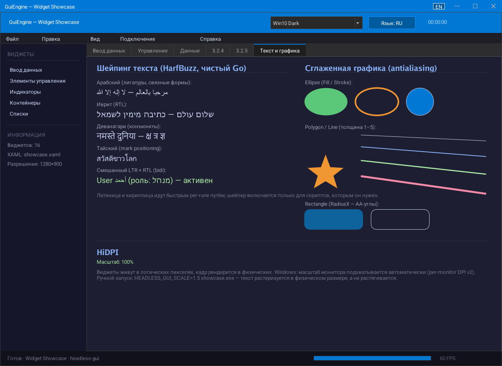

<a href="https://github.com/oops1/headless-gui">
     
     
</a>


# headless-gui

**English** · [Русский](README_RU.md)

Pure-Go headless GUI engine (zero CGO): WPF-style XAML, data binding, complex text shaping, antialiasing, HiDPI. Renders off-screen to 64×64 delta tiles — stream the UI **to any web browser** (built-in WebSocket viewer), over RDP, or show native windows (Win32 / X11 / Wayland / macOS).

## Overview

**headless-gui** renders a full widget UI off-screen into an RGBA buffer and streams only changed 64x64 tiles (delta compression). The engine knows nothing about displays or OS windows — you feed it mouse/keyboard events and consume rendered frames through a Go channel. This makes it suitable for remote desktop protocols, WebSocket-based thin clients, automated testing, and native windows alike.

## Screenshots

Rendered headlessly by the engine itself (no OS window involved):

| Widget showcase | Text shaping & antialiased graphics |
|---|---|
|  |  |

## Performance

Software renderer, fully on CPU (Intel Core Ultra 7 265K, single engine):

| Scenario | Cost |
|---|---|
| Idle UI (render-on-demand, default) | ~0 CPU — frames are skipped entirely |
| Button hover (event + partial redraw + tile diff) | ~45 µs |
| Partial frame via `InvalidateRect` | ~38 µs |
| Full 1280×800 frame, ~180 text labels | ~2.2 ms |
| Text line, 40 glyphs (cached) | ~13 µs / shaped Arabic ~3 µs |
| Full-HD tile diff (no changes, parallel) | ~110 µs |

Run `go test ./engine/ -bench .` to reproduce.

**AVX2 build (optional).** Built with `GOEXPERIMENT=simd` on Go 1.27+ (amd64), the hottest pixel loops — mask blending for text and AA shapes, translucent fills, channel swap on present, backdrop blur — run on AVX2: the full frame gets ~39 % cheaper, presenting a 1080p frame 2.9× faster, `BlurRGBA` 8.4× faster. Output is bit-identical to the scalar path, and the vector set is chosen at startup only if the CPU has AVX2 and passes a self-test; otherwise — or with `HEADLESS_GUI_NOSIMD=1` — the scalar path runs. Details: [GUIDE_EN.md](GUIDE_EN.md), "Vector kernels".

## Features

- **Off-screen rendering** — no OS window required; output via `<-chan output.Frame`
- **Delta tile streaming** — only changed 64x64 regions are sent each frame
- **Browser viewer out of the box** — `output/webstream` streams the UI to any browser over WebSocket (zero-dep RFC 6455 server, per-tile PNG, keyframe for new clients, multiple concurrent viewers) and feeds mouse/keyboard back; one Go process on the server, no rebuild for the client. The full widget showcase runs this way: `go run ./cmd/webshowcase` serves the very same UI as the native window, with no OS window opened at all
- **Standard dialogs, fully engine-drawn** — MessageBox with severity icons (Enter/Esc, Windows-style Ctrl+C dump), input and progress dialogs, file Open/Save/Folder with a built-in browser (places sidebar, clickable breadcrumb, columns) — they work headless and show the *server's* filesystem when streaming; themed and localized (EN/RU built in, live language switch)
- **Multiline TextBox editor** — word wrap or horizontal scroll, mouse/keyboard selection, Ctrl+arrows word jumps, PgUp/PgDn, clipboard, undo/redo, context menu; caret math works headless. Fit for code: named (monospace) font, Tab stops (`AcceptTab`/`TabSize`), per-range syntax highlighting through `Styler`, horizontal scrollbar, and big documents without per-frame copies
- **Full keyboard layouts on Linux** — Wayland xkb keymap parsing (live layout switching) and X11 `GetKeyboardMapping`, so Russian/US/… layouts type correctly in native windows
- **Complete keyboard and mouse model** — the full key table (letters, numerals, numpad, OEM keys, F1–F24) bound to the *physical* key, so Ctrl+S works under any layout; Alt and F10, AltGr and surrogate pairs on Windows, auto-repeat on Wayland (`KeyEvent.Repeat`), horizontal wheel, `MouseEvent.Clicks` (double and triple click counted once by the engine)
- **IME (CJK input)** — uncommitted text is shown in place, underlined, and replaced by the chosen candidate: Windows (IMM32, candidate window under the caret) and Wayland (`text-input-v3`, when the compositor has it); no X11 XIM
- **Clipboard** — text on every platform; on Linux built in (Wayland `wl_data_device`, X11 selections), no `xclip`/`wl-copy` needed; formatted text too: `SetClipboardHTML` puts HTML next to plain text (Windows, Wayland, X11), `ClipboardHTML` reads it; and files: `ClipboardSetFiles`/`ClipboardFiles` — understood by Explorer, Nautilus, Dolphin and RDP (`CF_HDROP`, `text/uri-list`, `x-special/gnome-copied-files`)
- **Animation framework** — `Animate`/`AnimateOwned` (CSS-transition-style owner replacement), 13 canonical easing curves, Lerp helpers; the clock belongs to the engine (no goroutines/timers per animation), frames are produced only while animations run and repaint partially; ToggleSwitch knob, dialog fade-in and `ProgressBar.AnimateValue` ship animated out of the box (`showcase` → Animations tab)
- **Render-on-demand by default** — widgets self-invalidate; only the damaged region is redrawn and diffed (idle UI costs ~0 CPU, a hover ~45 µs)
- **Complex text shaping** — HarfBuzz-quality shaping in pure Go (go-text/typesetting): Arabic ligatures & joining, Hebrew RTL, Devanagari conjuncts, Thai marks, mixed-bidi strings; Latin/Cyrillic keep a fast per-rune glyph cache
- **Antialiasing** — smooth rounded corners (cached quarter-disc masks), AA ellipses/lines/polygons via vector rasterization
- **HiDPI** — widgets live in logical pixels (WPF DIP model), frames render at physical resolution; per-monitor DPI awareness (v2) + `WM_DPICHANGED` on Windows, `Xft.dpi` on X11, `wl_output`/fractional scale on Wayland (live monitor changes), `HEADLESS_GUI_SCALE` overrides everywhere
- **XAML layout** — load UI from WPF-compatible `.xaml` files (opens in Blend / Visual Studio)
- **Grid layout** — WPF-style `<Grid>` with Pixel / Star / Auto sizing, `Grid.Row`, `Grid.Column`, spans
- **Theming** — built-in Dark and Light themes, 80+ customizable color tokens
- **Themes as data and a system taskbar** — the `theme/` and `desktop/` packages: a theme profile (colors, metrics, flags, fonts, icons, animations, presenters) inherits from another profile, loads from JSON and switches live; ready-made Windows 11 / Windows 10 / Windows 2000 / macOS profiles with light and dark variants. The taskbar, Start button, application area, tray icons, clock, Start menu, calendar, quick settings and notification center live in the engine and change their looks with the theme — a theme may also bring its own drawing for a component (under macOS the application area becomes a dock); under Windows 10 the Start menu becomes a sidebar + app list with letters + live tiles with drag-and-drop reordering, and the taskbar gets a search box whose results appear inside the menu; under Windows 11 the quick settings become the 24H2 panel (tiles from a consumer model, nested pages, volume and brightness sliders, edit mode); the notification center becomes cards with a "Do not disturb" bell and the calendar a separate card with a "Focus" timer module. Demo: `go run ./cmd/desktopdemo`
- **A frame pipeline built for the consumer** — the engine reports more than pixels: `Frame.Regions` says what each tile is made of (a solid color and its value, text, an image), `Frame.Moves` says content merely moved (window dragging). Subtrees outside the changed area are not walked at all; frame pacing can be taken over (`SetPacing`/`RequestFrame`/`SetFrameSink`) and the frame produced on your own goroutine
- **Windows 11 taskbar** — the Start/search/Task View/window-button group centres or moves left on the fly (`Taskbar.SetAlignment`, or the `taskbar.centered` flag), a widgets slot at the left edge (`WidgetsButton`: weather icon, temperature, caption from the consumer), a Task View button, search as an icon, an icon with a label or a 32 px rounded field, "network + volume + power" as one tray button (`TrayGroup`), a bell with Do Not Disturb, and window-button indicators driven by `WindowInfo`: the pill (6 px running, 16 px active in the accent, animated width), a progress bar (normal / paused / error), a counter badge and a blinking "attention" plate; honours `motion.reduce`, repaints only the changed button
- **Soft shadows, glass and rounded clipping** — `Elevation` and `BackdropSpec` in a theme style: backdrop blur (acrylic/mica) via a separate box-blur pass, shadows with a smooth falloff, clipping along the rounded outline instead of its bounding box. Windows 11 materials: `BackdropMaterial` Solid / Acrylic / Mica / MicaAlt (Mica blurs the wallpaper, cheap to redraw and identical on partial frames), shadow tokens `ShadowBlur/ShadowOffset/ShadowOpacity`, and the `motion.reduce` flag
- **Drag & drop** — panels are draggable with recursive child movement
- **Modal dialogs** — centered overlay with background dim, input isolation; on Win32/X11 each dialog opens in its **own OS window** (can exceed the main window and drag outside it), with in-canvas fallback on Wayland/macOS/headless
- **Native popups** — dropdowns and context/tray menus open in their own OS windows at the target point and are **not clipped** by the main window's edge (Win32/X11, and Wayland through `xdg_popup`; in-canvas fallback on macOS and headless)
- **Tray & notifications** — `SetTrayIcon`/`SetTrayMenu`/`ShowBalloon`, `HideToTray`/`RestoreFromTray`. Windows: Shell_NotifyIcon, balloon severity icons, live taskbar/Aero-Peek thumbnails. Linux (X11 and Wayland): StatusNotifierItem tray with a dbusmenu menu and `org.freedesktop.Notifications` over the engine's own D-Bus client, no external tools (GNOME needs the AppIndicator extension to show a tray). macOS: polite no-ops
- **Font support** — TTF fonts via `golang.org/x/image/font`; custom registration by name
- **Cascading menus** — nested submenus with arrow indicators and keyboard navigation; the shortcut written at the right edge (`MenuItem.Shortcut`) and `_File`-style mnemonics (`UseMnemonics`)
- **Native window** — platform-native backends (Win32/Cocoa/X11/**Wayland**), zero CGO on all platforms; Wayland speaks the raw wire protocol (xdg-shell + wl_shm) over a unix socket and is auto-selected when a compositor is available (`HEADLESS_GUI_X11=1` forces X11); window chrome follows the theme, reacts to OS focus (inactive title bar), repaints from the frame cache on expose (X11/Win32; Wayland retains content)
- **Window management** — several independent top-level windows in one process (`OpenWindow`), Windows 11 Snap Layouts and edge snapping (`SetHitTest`), system move and resize on X11 and Wayland (`BeginMove`/`BeginResize`), X11 cursor shapes, Wayland minimize/maximize
- **Title-bar tabs** — the tab strip scrolls (wheel, `ScrollTitleTabs`, follows the active tab) and tabs reorder by dragging (`MoveTitleTab`, `OnTitleTabMoved`)
- **Talking to the OS** — `window.OpenURL`/`OpenFile`/`RevealFile` (ShellExecute on Windows, the OpenURI portal on Linux with no external tools, `open` on macOS; only safe URL schemes, executables are refused) and the system theme: `DetectSystemTheme` + `SetOnSystemThemeChanged` (Windows, Linux; macOS reports "unknown")
- **Timers owned by the engine** — `eng.After` and `eng.Every` run on the engine goroutine and stop with it; `Every` schedules the next run after the handler returns, so a slow handler never piles up a queue
- **Printing and PDF** — render pages with the same drawing context as the screen, then send them to a printer or save as PDF. `printing` has paper sizes (A3–A6, Letter, Legal, custom), orientation, margins, printer list and `Print`; the system print dialog and GDI on Windows, IPP to CUPS on Linux (no `lp`/`lpr`), not supported on macOS; `output/pdf` writes PDF from page images with no dependencies (Flate or JPEG, page by page) on every platform
- **Golden render tests** — pixel-exact snapshot tests of widgets/themes/AA/HiDPI guard against visual regressions (CI on Windows/Linux/macOS)
- **Accessibility semantic tree** — `eng.AccessibilityTree()` returns a JSON-serializable snapshot (roles, names, values, states) for screen-reader side-channels in streaming scenarios and for UI test automation; full keyboard navigation (Tab/Enter/Space) built in. Platform bridges: UI Automation on Windows (Value and Text patterns) and AT-SPI on Linux (Text interface) — screen readers follow the caret and read text by character, word, line and paragraph
- **Data binding** — `{Binding}` OneWay/TwoWay/OneTime, `INotifyPropertyChanged`, `StringFormat`, `IValueConverter`, `ElementName`/`RelativeSource`, live `ItemsControl`
- **Styles, triggers & templates** — `<Style>`/`<Setter>`, `DataTrigger`/`MultiTrigger`, `ControlTemplate` + `ContentPresenter` + `TemplateBinding`, `StaticResource`
- **Commands & input bindings** — `ICommand`/`RelayCommand`, `Button.Command`, `<KeyBinding>` hotkeys
- **Localization** — UI language **independent of keyboard layout**; `{Loc Key}` markup + string tables (JSON), live re-translation
- **Validation** — `IDataErrorInfo` / `ValidatesOnDataErrors=True` with red error adorner
- **CollectionView & UI virtualization** — sort/filter/group over a collection; `VirtualizingItemsControl` renders only visible rows (100k+ items)
- **Vector shapes** — `Ellipse`, `Rectangle`, `Line`, `Polygon`, `Polyline` with `Fill`/`Stroke`
- **SVG icons** — themeable `SVGIcon` widget + `widget/svg` subset parser/AA rasterizer (`currentColor`, monochrome tint); paths/arcs/basic shapes/transforms/even-odd
- **SplitPanel** — two panes with a draggable splitter (fraction-based position, min sizes, double-click collapse, nesting)
- **DiffView** — side-by-side file comparison with editing: synced scrolling, S-connectors, block copy, intra-line diff, syntax highlight, file watching; CRLF/BOM preserved on save
- **MergeView** — three-way merge: ours, base and theirs on top with rows aligned by chunk, editable result below; per-chunk resolutions (ours / theirs / base / both) by button, menu or Alt+1/2/3, git conflict markers (merge or diff3 style) for what is still unresolved
- **RichText** — formatted text: paragraphs of runs with their own font, size, color, background, underline, strikethrough and links, word wrap, alignment, selection by drag/double/triple click; Ctrl+C copies plain text and HTML. With `Editable` it is an editor — typing, Enter/Shift+Enter, undo/redo, Ctrl+B/I/U and toolbar commands, paste of HTML from Word or a browser, IME; `HTML()`/`SetHTML()`. XAML: `<RichText>`, `<Paragraph>`, `<Run>`, `<Bold>`, `<Italic>`, `<Underline>`, `<Hyperlink>`, `<LineBreak/>`. No lists, tables or images yet
- **DatePicker** — date field with a drop-down month calendar: typed or picked, forgiving parsing, format and first weekday taken from the UI language's string tables (RU/EN built in, ISO 8601 otherwise), selectable date range
- **What an editor needs** — `win.SetTitle` and `win.SetOnCloseRequest` (a "Save changes?" prompt before the window closes), widgets that take Tab for themselves (`TabAcceptor`), antialiased paths with fractional coordinates and joined bends (`PathShapes`: cubic curves, polylines, fills), diff and syntax colors in the theme, accessibility children for self-drawn widgets, nested clipping (`widget.PushClip`), font ascent/descent for aligning mixed sizes (`MeasureUIFontMetrics`), custom drop-downs in file dialogs (`FileDialogOptions.Choices`, ready-made `EncodingChoice`)
- **AVX2 pixel kernels** — optional `GOEXPERIMENT=simd` build (Go 1.27+, amd64): text, AA shapes, fills, blur and frame presentation on AVX2, bit-identical to the scalar path, with CPU detection and a startup self-test falling back automatically
- **Docking panels** — `DockManager`/`DockPane`, Visual Studio-style Toolbox docking: center + 4 dockable sides, stack tabs, auto-hide, drag&dock with guides, gutter resize, save/restore layout (JSON)
- **Smooth / inertial scroll** — pixel-precise wheel/touchpad deltas (`SendMouseWheelPixels`) with a decaying flywheel in `ScrollView` (Win32 + Wayland pixel deltas; X11 keeps ticks); `ScrollView` also scrolls sideways (`ContentWidth`, horizontal wheel, Shift+wheel)
- **File drag & drop from the OS** — drop files from Explorer/Finder into the window (`SetOnFilesDropped` / `FileDropTarget`); Win32 + X11 native, Wayland skeleton
- **Color emoji** — COLR/CBDT/sbix color glyphs render automatically in the text path (COLRv1 gradients averaged; regional-flag ligatures a known gap)
- **Tooltips & cursors** — `ToolTip` on every widget; per-widget mouse cursors
- **Free bundled fonts** — Roboto (default), Open Sans, Inter + system glyph fallback chain (no tofu)

## Widget List

| Widget | XAML Tag | Description |
|---|---|---|
| Panel | `Canvas`, `Border`, `StackPanel`, `DockPanel` | Container, drag, rounded corners, title bar, background image |
| Grid | `Grid` | WPF-style grid with RowDefinitions/ColumnDefinitions (Pixel/Star/Auto) |
| Label | `Label`, `TextBlock` | Static text, word wrap (`TextWrapping="Wrap"`) |
| Button | `Button`, `ToggleButton`, `RepeatButton` | Click handler, hover/press/accent states, custom colors |
| TextInput | `TextBox`, `TextInput` | Single-line: selection, clipboard, Home/End, undo/redo, context menu |
| TextBox | `TextBox AcceptsReturn="True"` / `TextWrapping="Wrap"` | Multiline editor: word wrap, vertical scroll, Ctrl+arrows, PgUp/PgDn, clipboard, undo/redo; for code — `FontName`, `AcceptTab`/`TabSize`, `Styler` highlighting, horizontal scrollbar |
| RichText | `RichText` (`Paragraph`, `Run`, `Bold`, `Italic`, `Underline`, `Hyperlink`, `LineBreak`) | Formatted text with mixed fonts, sizes and colors, links, selection, HTML in the clipboard; with `Editable` — a rich-text editor with undo/redo and HTML paste |
| PasswordBox | `PasswordBox` | Masked input |
| Dropdown | `ComboBox`, `Dropdown` | Overlay popup, keyboard nav |
| ProgressBar | `ProgressBar` | `Value` 0.0..1.0, custom fill color |
| CheckBox | `CheckBox` | Toggle with label |
| RadioButton | `RadioButton` | Mutual exclusion by `GroupName` |
| ToggleSwitch | `ToggleSwitch` | On/Off with animated knob |
| Slider | `Slider` | Min/Max/Value, drag thumb |
| NumericUpDown | `NumericUpDown` / `IntegerUpDown` / `DoubleUpDown` | Spinner ▲/▼, wheel, typing, Min/Max/Increment/Decimals |
| TabControl | `TabControl` / `TabItem` | Multiple tabs with content widgets |
| ScrollView | `ScrollViewer` | Scrollbar, mouse wheel, `ContentHeight`; sideways with `ContentWidth` |
| ListView | `ListView`, `ListBox` | Selection, keyboard nav, scrollbar (virtualized) |
| VirtualizingItemsControl | `VirtualizingItemsControl` | UI virtualization — materializes only visible rows; CollectionView-aware |
| Image | `Image` | PNG/JPEG, stretch modes (Fill/Uniform/None) |
| PopupMenu | `PopupMenu`, `ContextMenu` | Context/popup menu, overlay, keyboard nav |
| MenuBar | `Menu`, `MenuBar`, `MainMenu` | Horizontal menu bar with dropdown submenus |
| WrapPanel | `WrapPanel` | Flow layout, wraps children to next line |
| UniformGrid | `UniformGrid` | Equal-sized cells, `Rows`/`Columns` |
| GroupBox | `GroupBox` | Titled bordered container (content clipped to bounds) |
| Expander | `Expander` | Collapsible panel with header arrow |
| Shapes | `Ellipse`, `Rectangle`, `Line`, `Polygon`, `Polyline` | Vector shapes with `Fill`/`Stroke`/`StrokeThickness` |
| Separator | `Separator` | Divider line |
| MessageBox | — (code only) | Severity presets (Info/Question/Warning/Error), OK/YesNo/YesNoCancel, Enter/Esc, Ctrl+C dump |
| InputDialog / ProgressDialog | — (code only) | Prompt with validation & hint; progress with detail line, percent, indeterminate |
| FileDialog | — (code only) | Open / Save / Pick-folder with built-in browser (places, breadcrumb, columns, filters, your own drop-downs such as "Encoding") |
| Dialog | — (code only) | Modal base: rounded chrome + shadow, ✕ close, custom content |
| Window | `Window` | Native OS window with title bar (Win/Mac style), resize, minimize/maximize, scrollable and reorderable title-bar tabs |
| TreeView | `TreeView` | WPF-compatible hierarchical tree with virtualization, HierarchicalDataTemplate, icons, keyboard nav |
| GridSplitter | `GridSplitter` | Resizable splitter between Grid cells |
| SplitPanel | `SplitPanel` | Two panes with a draggable splitter, fraction position, min sizes, double-click collapse |
| DiffView | `DiffView` | Compare and edit two files: synced scroll, block copy, intra-line diff, syntax highlight, file watching |
| MergeView | `MergeView` | Three-way merge: ours/base/theirs on top, editable result below, per-chunk resolutions, git conflict markers |
| DatePicker | `DatePicker` | Date field with a drop-down month calendar, culture-aware format and first weekday, date range |
| SVGIcon | `SVGIcon` | Themeable vector icon (SVG subset), `currentColor` / `Tint` recoloring |
| DockManager | `DockManager` | VS-style docking zone: center + 4 dockable sides, gutter resize, stack tabs, auto-hide, drag&dock |
| DockPane | `DockPane` | Single docking panel hosted by `DockManager`: title bar with pin/float/close, Docked/AutoHidden/Floating/Closed |
| StatusBar | `StatusBar` | Bottom status bar with text |
| DataGrid | `DataGrid` | WPF-compatible data table with columns, sorting, cell editing, resize, Data Binding, ObservableCollection |

## Quick Start

### Headless (no window)

```bash
go run main.go
# Renders demo UI, writes PNG frames to out_test/
```

### Browser (WebSocket streaming)

```bash
go run ./cmd/webshowcase   # the whole widget showcase, streamed
# open http://localhost:8091 — the UI runs on the server, no native window at all
#
# go run ./cmd/webdemo     # minimal streaming example (a few widgets)
```

### Native Window

```bash
go run ./cmd/showcase    # Full widget showcase
go run ./cmd/smartgit    # SmartGit-like UI demo
go run ./cmd/diffdemo    # compare and edit two files (DiffView)
go run ./cmd/mergedemo   # resolve a merge conflict (MergeView)
```

Windows binary without console:

```bash
go build -ldflags="-H windowsgui" -o showcase.exe ./cmd/showcase
```

## Project Structure

```
headless-gui/
  engine/          Core: canvas, render loop, event dispatch, font manager
  widget/          All widgets, themes, XAML loader, Grid layout, drag support
    treeview/      WPF-compatible TreeView (core logic, no widget dependency)
    datagrid/      DataGrid core logic (ObservableCollection, PropertyNotifier)
  output/          Frame + DirtyTile types for delta streaming
    webstream/     Browser viewer: WebSocket tile streaming + input (zero-dep)
    pdf/           PDF writer from page images (zero-dep, Flate/JPEG)
  printing/        Printing: paper, orientation, margins, printers, system dialog; SavePDF
  window/          Native window (Win32/Cocoa/X11/Wayland, zero CGO)
  cmd/
    showcase/      Full widget showcase (all widgets + live animation)
    webshowcase/   The full showcase in a browser (http://localhost:8091)
    webdemo/       Minimal browser streaming example
    smartgit/      SmartGit-like UI (Window + Menu + TreeView + DataGrid)
    diffdemo/      File comparison app on DiffView
    mergedemo/     Merge conflict resolver on MergeView
    socialpreview/ Repository preview image (social_preview.png), drawn by the engine
  assets/ui/       XAML demo layouts (demo.xaml, grid_demo.xaml, showcase.xaml)
  gui/             XAML files for RDP UI (login, block, error dialogs)
  tests/           Unit tests (engine, widgets, drag, modals)
  main.go          Headless demo entry point
```

## Minimal Example

```go
package main

import (
    "image"
    "image/color"
    "github.com/oops1/headless-gui/v3/engine"
    "github.com/oops1/headless-gui/v3/widget"
)

func main() {
    eng := engine.New(800, 600, 30)

    root := widget.NewPanel(color.RGBA{R: 30, G: 30, B: 30, A: 255})
    root.SetBounds(image.Rect(0, 0, 800, 600))

    btn := widget.NewWin10AccentButton("Click me")
    btn.SetBounds(image.Rect(50, 50, 200, 90))
    btn.OnClick = func() { /* handle click */ }
    root.AddChild(btn)

    eng.SetRoot(root)
    eng.Start()
    defer eng.Stop()

    for frame := range eng.Frames() {
        _ = frame // frame.Tiles contains only changed 64x64 regions
    }
}
```

## XAML Support

UI can be defined in WPF-compatible XAML and loaded at runtime:

```xml
<Canvas Name="root" Width="800" Height="600" Background="#1E1E2E">

    <Grid Left="50" Top="50" Width="700" Height="500" ShowGridLines="True">
        <Grid.RowDefinitions>
            <RowDefinition Height="48"/>
            <RowDefinition Height="*"/>
            <RowDefinition Height="40"/>
        </Grid.RowDefinitions>
        <Grid.ColumnDefinitions>
            <ColumnDefinition Width="200"/>
            <ColumnDefinition Width="*"/>
        </Grid.ColumnDefinitions>

        <Label Grid.Row="0" Grid.Column="0" Grid.ColumnSpan="2"
               Text="Header" Foreground="White" Background="#0078D4"/>
        <TextBox Grid.Row="1" Grid.Column="1" Placeholder="Type here..."/>
        <Button Grid.Row="2" Grid.Column="1" Content="OK" Style="Accent"/>
    </Grid>

</Canvas>
```

```go
root, named, err := widget.LoadUIFromXAMLFile("gui/window.xaml")
if btn, ok := named["btnOK"].(*widget.Button); ok {
    btn.OnClick = func() { /* ... */ }
}
eng.SetRoot(root)
```

Coordinates inside containers are relative (standard WPF Canvas behavior).

## Dependencies

| Module | Dependency |
|---|---|
| `github.com/oops1/headless-gui/v3` | `golang.org/x/image` |
| `github.com/oops1/headless-gui/v3/window` | `golang.org/x/sys/windows`, `github.com/ebitengine/purego` |

Go 1.22+. The `window/` module is optional — the core engine has zero CGO dependencies. The window module is also CGO-free on all platforms.

The optional AVX2 kernels need **Go 1.27+** built with `GOEXPERIMENT=simd` on amd64 (the experimental `simd/archsimd` API changed between 1.26 and 1.27). With an older toolchain, without the experiment or on another architecture the engine builds as usual and uses the scalar path — `go.mod` stays at `go 1.22`.

## Documentation

Full developer guide with widget API, XAML reference, Grid layout, theming, event system, font registration, and architecture details:

- [GUIDE.md](GUIDE.md) — Русский
- [GUIDE_EN.md](GUIDE_EN.md) — English

AI-agent reference (API cheatsheet + repo working rules): [docs/AI_AGENT_REFERENCE.md](docs/AI_AGENT_REFERENCE.md).

## License

[MIT](LICENSE)
