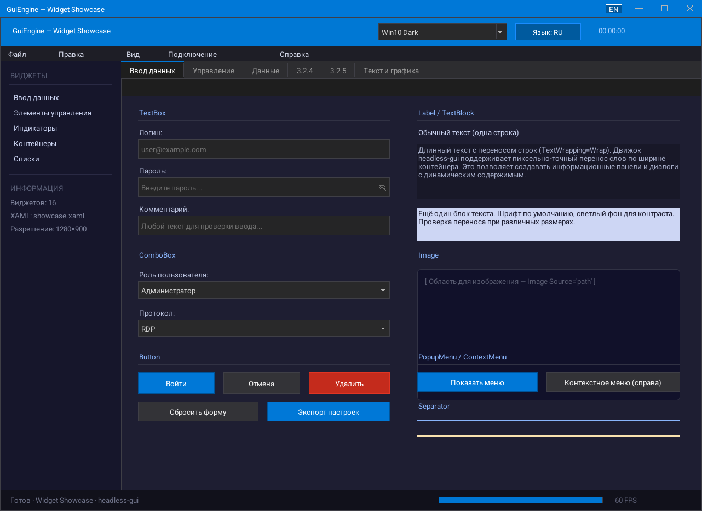
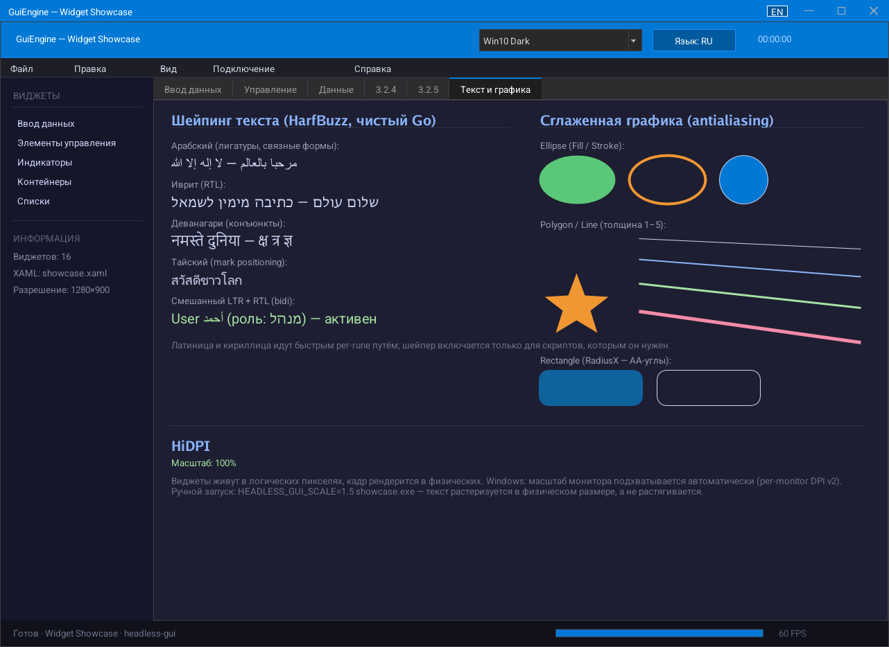

<a href="https://github.com/oops1/headless-gui">
     
</a>


# headless-gui

[English](README.md) · **Русский**

GUI-движок на чистом Go (zero CGO): WPF-стиль XAML, привязка данных, сложный текстовый шейпинг, сглаживание, HiDPI. Рендерит off-screen в дельта-тайлы 64×64 — стримьте интерфейс **в любой браузер** (встроенный WebSocket-вьювер), по RDP или показывайте нативные окна (Win32 / X11 / Wayland / macOS).

## Обзор

**headless-gui** рендерит полноценный виджетный UI off-screen в RGBA-буфер и передаёт только изменившиеся тайлы 64×64 (дельта-сжатие). Движок ничего не знает о дисплеях и окнах ОС — вы подаёте ему события мыши/клавиатуры и читаете готовые кадры из Go-канала. Это делает его пригодным для протоколов удалённого рабочего стола, тонких WebSocket-клиентов, автоматизированного тестирования — и для нативных окон тоже.

## Скриншоты

Отрисовано самим движком в headless-режиме (без окна ОС):

| Витрина виджетов | Шейпинг текста и сглаженная графика |
|---|---|
|  |  |

## Производительность

Программный рендер, полностью на CPU (Intel Core Ultra 7 265K, один движок):

| Сценарий | Стоимость |
|---|---|
| UI в простое (рендер по запросу, по умолчанию) | ~0 CPU — кадры пропускаются целиком |
| Hover по кнопке (событие + частичная перерисовка + дифф тайлов) | ~45 мкс |
| Частичный кадр через `InvalidateRect` | ~38 мкс |
| Полный кадр 1280×800, ~180 текстовых меток | ~2,2 мс |
| Строка текста, 40 глифов (кэш) | ~13 мкс / шейпленный арабский ~3 мкс |
| Дифф тайлов Full-HD (без изменений, параллельно) | ~110 мкс |

Воспроизведение: `go test ./engine/ -bench .`

## Возможности

- **Off-screen рендеринг** — окно ОС не требуется; вывод через `<-chan output.Frame`
- **Дельта-стриминг тайлов** — каждый кадр передаются только изменившиеся области 64×64
- **Вьювер в браузере из коробки** — `output/webstream` стримит UI в любой браузер по WebSocket (RFC 6455-сервер без зависимостей, PNG на тайл, keyframe новым клиентам, несколько одновременных вьюверов) и возвращает мышь/клавиатуру; один Go-процесс на сервере, клиент без пересборки. Так работает и полная витрина виджетов: `go run ./cmd/webshowcase` отдаёт в браузер тот же UI, что и нативное окно, не открывая ни одного окна ОС
- **Стандартные диалоги, целиком на движке** — MessageBox со значками severity (Enter/Esc, Ctrl+C-дамп в стиле Windows), диалоги ввода и прогресса, файловые Открыть/Сохранить/Папка со встроенным браузером (панель мест, кликабельный breadcrumb, колонки) — работают headless и при стриминге показывают файловую систему *сервера*; темизированы и локализованы (EN/RU встроены, живое переключение языка)
- **Многострочный редактор TextBox** — перенос по словам или горизонтальный скролл, выделение мышью/клавиатурой, Ctrl+стрелки по словам, PgUp/PgDn, буфер обмена, undo/redo, контекстное меню; расчёт каретки работает headless
- **Полные раскладки клавиатуры на Linux** — парсер xkb-keymap для Wayland (живое переключение раскладок) и X11 `GetKeyboardMapping`: русская/US/… раскладки корректно печатают в нативных окнах
- **Анимационный фреймворк** — `Animate`/`AnimateOwned` (замена по владельцу в духе CSS-transition), 13 канонических easing-кривых, Lerp-хелперы; часы у движка (ни одной горутины/таймера на анимацию), кадры идут только пока анимация живёт, перерисовка частичная; из коробки анимированы ручка ToggleSwitch, fade-in диалогов и `ProgressBar.AnimateValue` (`showcase` → вкладка «Анимации»)
- **Рендер по запросу по умолчанию** — виджеты самоинвалидируются; перерисовывается и диффается только повреждённая область (UI в простое ~0 CPU, hover ~45 мкс)
- **Сложный текстовый шейпинг** — качество HarfBuzz на чистом Go (go-text/typesetting): арабские лигатуры и соединения, иврит RTL, деванагари, тайские знаки, смешанный bidi; латиница/кириллица идут через быстрый по-рунный кэш глифов
- **Сглаживание** — гладкие скруглённые углы (кэш четверть-масок), AA-эллипсы/линии/полигоны через векторную растеризацию
- **HiDPI** — виджеты живут в логических пикселях (модель WPF DIP), кадры рендерятся в физическом разрешении; per-monitor DPI (v2) + `WM_DPICHANGED` на Windows, `HEADLESS_GUI_SCALE` на остальных
- **XAML-разметка** — загрузка UI из WPF-совместимых `.xaml` (открываются в Blend / Visual Studio)
- **Grid-раскладка** — WPF-стиль `<Grid>` с Pixel / Star / Auto, `Grid.Row`, `Grid.Column`, span'ы
- **Темизация** — встроенные тёмная и светлая темы, 80+ настраиваемых цветовых токенов
- **Темы как данные и системная панель задач** — пакеты `theme/` и `desktop/`: профиль темы (цвета, метрики, признаки, шрифты, иконки, анимации, презентеры) наследуется от другого профиля, грузится из JSON и меняется на лету; готовые профили Windows 11 / Windows 10 / Windows 2000 / macOS со светлыми и тёмными разновидностями. Панель задач, кнопка «Пуск», область приложений, значки трея, часы, меню «Пуск», календарь, быстрые настройки и центр уведомлений живут в движке и переключают облик вместе с темой — тема вправе принести и свою отрисовку компонента (под macOS область приложений превращается в док). Демонстрация: `go run ./cmd/desktopdemo`
- **Конвейер кадра для потребителя** — движок сообщает не только пиксели: `Frame.Regions` говорит, чем нарисован каждый тайл (сплошной цвет с его значением, текст, изображение), `Frame.Moves` — что содержимое переехало без изменений (перетаскивание окна). Поддеревья вне изменившейся области не обходятся вовсе; темп кадров можно забрать себе (`SetPacing`/`RequestFrame`/`SetFrameSink`) и готовить кадр в своей горутине
- **Мягкие тени, стекло и скруглённый клип** — `Elevation` и `BackdropSpec` в стиле темы: размытие подложки (акрил/слюда) через отдельный проход box-blur, тени с плавным спадом, обрезка по скруглённому контуру вместо охватывающего прямоугольника
- **Drag & drop** — панели перетаскиваются с рекурсивным перемещением детей
- **Модальные диалоги** — центрированный оверлей с затемнением фона и изоляцией ввода
- **Шрифты** — TTF через `golang.org/x/image/font`; регистрация своих по имени
- **Каскадные меню** — вложенные подменю со стрелками и клавиатурной навигацией
- **Нативное окно** — платформенные бэкенды (Win32/Cocoa/X11/**Wayland**), zero CGO на всех платформах; Wayland говорит на сыром wire-протоколе (xdg-shell + wl_shm) через unix-сокет и выбирается автоматически при наличии композитора (`HEADLESS_GUI_X11=1` форсирует X11); хром окна следует теме, реагирует на фокус ОС (неактивный заголовок), перерисовывается из кэша кадра по expose
- **Golden-тесты рендера** — попиксельные снапшот-тесты виджетов/тем/AA/HiDPI защищают от визуальных регрессий (CI на Windows/Linux/macOS)
- **Семантическое дерево доступности** — `eng.AccessibilityTree()` возвращает JSON-сериализуемый снимок (роли, имена, значения, состояния) для скринридеров в стриминговых сценариях и UI-автотестов; полная клавиатурная навигация (Tab/Enter/Space)
- **Привязка данных** — `{Binding}` OneWay/TwoWay/OneTime, `INotifyPropertyChanged`, `StringFormat`, `IValueConverter`, `ElementName`/`RelativeSource`, живой `ItemsControl`
- **Стили, триггеры и шаблоны** — `<Style>`/`<Setter>`, `DataTrigger`/`MultiTrigger`, `ControlTemplate` + `ContentPresenter` + `TemplateBinding`, `StaticResource`
- **Команды и горячие клавиши** — `ICommand`/`RelayCommand`, `Button.Command`, `<KeyBinding>`
- **Локализация** — язык интерфейса **не зависит от раскладки клавиатуры**; разметка `{Loc Key}` + строковые таблицы (JSON), живой перевод
- **Валидация** — `IDataErrorInfo` / `ValidatesOnDataErrors=True` с красным адорнером ошибки
- **CollectionView и UI-виртуализация** — сортировка/фильтр/группировка; `VirtualizingItemsControl` рендерит только видимые строки (100k+ элементов)
- **Векторные фигуры** — `Ellipse`, `Rectangle`, `Line`, `Polygon`, `Polyline` с `Fill`/`Stroke`
- **SVG-иконки** — темизируемый виджет `SVGIcon` + пакет `widget/svg` (парсер подмножества + AA-растеризатор): `currentColor`, монохромный `Tint`; path/дуги/базовые фигуры/трансформы/even-odd
- **SplitPanel** — две панели с перетаскиваемым разделителем (позиция-доля, минимумы, коллапс двойным кликом, гнездование)
- **Докинг-панели** — `DockManager`/`DockPane`, зона докинга в стиле Visual Studio Toolbox: центр + 4 пришвартовываемые стороны, табы стопки, auto-hide, drag&dock с направляющими, ресайз кромки, сохранение/восстановление раскладки (JSON)
- **Плавный / инерционный скролл** — точные пиксельные дельты колеса/тачпада (`SendMouseWheelPixels`) с затухающим «маховиком» в `ScrollView` (пиксельные дельты на Win32 и Wayland; X11 — тики)
- **Drag & Drop файлов из ОС** — перетаскивание файлов из проводника/Finder в окно (`SetOnFilesDropped` / `FileDropTarget`); Win32 и X11 нативно, Wayland — каркас
- **Цветные эмодзи** — глифы COLR/CBDT/sbix рендерятся в цвете автоматически (COLRv1-градиенты усредняются; флаги-лигатуры — известный пробел)
- **Подсказки и курсоры** — `ToolTip` у каждого виджета; курсор мыши на виджет
- **Свободные шрифты в комплекте** — Roboto (по умолчанию), Open Sans, Inter + системная цепочка фолбэков (без «тофу»)

## Список виджетов

| Виджет | XAML-тег | Описание |
|---|---|---|
| Panel | `Canvas`, `Border`, `StackPanel`, `DockPanel` | Контейнер, drag, скругления, заголовок, фоновое изображение |
| Grid | `Grid` | WPF-сетка с RowDefinitions/ColumnDefinitions (Pixel/Star/Auto) |
| Label | `Label`, `TextBlock` | Статический текст, перенос (`TextWrapping="Wrap"`) |
| Button | `Button`, `ToggleButton`, `RepeatButton` | Клик, hover/press/accent-состояния, свои цвета |
| TextInput | `TextBox`, `TextInput` | Однострочное поле: выделение, буфер обмена, Home/End, undo/redo, контекстное меню |
| TextBox | `TextBox AcceptsReturn="True"` / `TextWrapping="Wrap"` | Многострочный редактор: перенос по словам, верт. скролл, Ctrl+стрелки, PgUp/PgDn, буфер обмена, undo/redo |
| PasswordBox | `PasswordBox` | Маскированный ввод |
| Dropdown | `ComboBox`, `Dropdown` | Оверлей-попап, клавиатурная навигация |
| ProgressBar | `ProgressBar` | `Value` 0.0..1.0, свой цвет заливки |
| CheckBox | `CheckBox` | Переключатель с подписью |
| RadioButton | `RadioButton` | Взаимное исключение по `GroupName` |
| ToggleSwitch | `ToggleSwitch` | Вкл/выкл с анимированной ручкой |
| Slider | `Slider` | Min/Max/Value, перетаскивание ползунка |
| NumericUpDown | `NumericUpDown` / `IntegerUpDown` / `DoubleUpDown` | Спиннер ▲/▼, колесо, ввод, Min/Max/Increment/Decimals |
| TabControl | `TabControl` / `TabItem` | Вкладки с контентом |
| ScrollView | `ScrollViewer` | Скроллбар, колесо мыши, `ContentHeight` |
| ListView | `ListView`, `ListBox` | Выделение, клавиатура, скроллбар (виртуализирован) |
| VirtualizingItemsControl | `VirtualizingItemsControl` | UI-виртуализация — материализуются только видимые строки |
| Image | `Image` | PNG/JPEG, режимы растяжения (Fill/Uniform/None) |
| PopupMenu | `PopupMenu`, `ContextMenu` | Контекстное/попап-меню, оверлей, клавиатура |
| MenuBar | `Menu`, `MenuBar`, `MainMenu` | Горизонтальное меню с выпадающими подменю |
| WrapPanel | `WrapPanel` | Поточная раскладка с переносом |
| UniformGrid | `UniformGrid` | Равные ячейки, `Rows`/`Columns` |
| GroupBox | `GroupBox` | Рамка с заголовком (контент клиппится) |
| Expander | `Expander` | Сворачиваемая панель со стрелкой |
| Фигуры | `Ellipse`, `Rectangle`, `Line`, `Polygon`, `Polyline` | Векторные фигуры с `Fill`/`Stroke`/`StrokeThickness` |
| Separator | `Separator` | Разделительная линия |
| MessageBox | — (только код) | Пресеты severity (Info/Question/Warning/Error), OK/YesNo/YesNoCancel, Enter/Esc, Ctrl+C-дамп |
| InputDialog / ProgressDialog | — (только код) | Ввод с валидацией и подсказкой; прогресс с деталями, процентом, indeterminate |
| FileDialog | — (только код) | Открыть / Сохранить / Выбор папки со встроенным браузером (места, breadcrumb, колонки, фильтры) |
| Dialog | — (только код) | Модальная база: скруглённый хром + тень, ✕, свой контент |
| Window | `Window` | Нативное окно ОС с заголовком (Win/Mac-стиль), resize, minimize/maximize |
| TreeView | `TreeView` | WPF-совместимое дерево: виртуализация, HierarchicalDataTemplate, иконки, клавиатура |
| GridSplitter | `GridSplitter` | Перетаскиваемый разделитель между ячейками Grid |
| SplitPanel | `SplitPanel` | Две панели с перетаскиваемым разделителем, позиция-доля, минимумы, коллапс двойным кликом |
| SVGIcon | `SVGIcon` | Темизируемая векторная иконка (подмножество SVG), перекраска `currentColor` / `Tint` |
| DockManager | `DockManager` | Зона докинга в стиле VS: центр + 4 пришвартовываемые стороны, ресайз кромки, табы стопки, auto-hide, drag&dock |
| DockPane | `DockPane` | Отдельная панель докинга внутри `DockManager`: титлбар с pin/float/close, Docked/AutoHidden/Floating/Closed |
| StatusBar | `StatusBar` | Нижняя строка состояния |
| DataGrid | `DataGrid` | WPF-совместимая таблица: колонки, сортировка, редактирование ячеек, resize, Binding, ObservableCollection |

## Быстрый старт

### Headless (без окна)

```bash
go run main.go
# Рендерит демо-UI, пишет PNG-кадры в out_test/
```

### Браузер (WebSocket-стриминг)

```bash
go run ./cmd/webshowcase   # вся витрина виджетов, отданная в браузер
# открыть http://localhost:8091 — UI работает на сервере, ни одного нативного окна
#
# go run ./cmd/webdemo     # минимальный пример стриминга (несколько виджетов)
```

### Нативное окно

```bash
go run ./cmd/showcase    # Полная витрина виджетов
go run ./cmd/smartgit    # UI в духе SmartGit
```

Windows-бинарник без консоли:

```bash
go build -ldflags="-H windowsgui" -o showcase.exe ./cmd/showcase
```

## Структура проекта

```
headless-gui/
  engine/          Ядро: canvas, рендер-цикл, диспетчер событий, шрифты
  widget/          Все виджеты, темы, XAML-загрузчик, Grid, drag
    treeview/      Ядро TreeView (без зависимости от widget)
    datagrid/      Ядро DataGrid (ObservableCollection, PropertyNotifier)
  output/          Типы Frame + DirtyTile для дельта-стриминга
    webstream/     Браузерный вьювер: WebSocket-стрим тайлов + ввод (без зависимостей)
  window/          Нативное окно (Win32/Cocoa/X11/Wayland, zero CGO)
  cmd/
    showcase/      Полная витрина виджетов (+ живая анимация)
    webshowcase/   Полная витрина в браузере (http://localhost:8091)
webdemo/       Минимальный пример стриминга
    smartgit/      UI в духе SmartGit (Window + Menu + TreeView + DataGrid)
  assets/ui/       XAML-демо (demo.xaml, grid_demo.xaml, showcase.xaml)
  gui/             XAML для RDP-UI (логин, блокировка, диалоги ошибок)
  tests/           Юнит-тесты (движок, виджеты, drag, модалки)
  main.go          Точка входа headless-демо
```

## Минимальный пример

```go
package main

import (
    "image"
    "image/color"
    "github.com/oops1/headless-gui/v3/engine"
    "github.com/oops1/headless-gui/v3/widget"
)

func main() {
    eng := engine.New(800, 600, 30)

    root := widget.NewPanel(color.RGBA{R: 30, G: 30, B: 30, A: 255})
    root.SetBounds(image.Rect(0, 0, 800, 600))

    btn := widget.NewWin10AccentButton("Нажми меня")
    btn.SetBounds(image.Rect(50, 50, 200, 90))
    btn.OnClick = func() { /* обработка клика */ }
    root.AddChild(btn)

    eng.SetRoot(root)
    eng.Start()
    defer eng.Stop()

    for frame := range eng.Frames() {
        _ = frame // frame.Tiles — только изменившиеся области 64×64
    }
}
```

## Поддержка XAML

UI можно описать в WPF-совместимом XAML и загрузить в рантайме:

```xml
<Canvas Name="root" Width="800" Height="600" Background="#1E1E2E">

    <Grid Left="50" Top="50" Width="700" Height="500" ShowGridLines="True">
        <Grid.RowDefinitions>
            <RowDefinition Height="48"/>
            <RowDefinition Height="*"/>
            <RowDefinition Height="40"/>
        </Grid.RowDefinitions>
        <Grid.ColumnDefinitions>
            <ColumnDefinition Width="200"/>
            <ColumnDefinition Width="*"/>
        </Grid.ColumnDefinitions>

        <Label Grid.Row="0" Grid.Column="0" Grid.ColumnSpan="2"
               Text="Заголовок" Foreground="White" Background="#0078D4"/>
        <TextBox Grid.Row="1" Grid.Column="1" Placeholder="Введите текст..."/>
        <Button Grid.Row="2" Grid.Column="1" Content="OK" Style="Accent"/>
    </Grid>

</Canvas>
```

```go
root, named, err := widget.LoadUIFromXAMLFile("gui/window.xaml")
if btn, ok := named["btnOK"].(*widget.Button); ok {
    btn.OnClick = func() { /* ... */ }
}
eng.SetRoot(root)
```

Координаты внутри контейнеров относительные (стандартное поведение WPF Canvas).

## Зависимости

| Модуль | Зависимость |
|---|---|
| `github.com/oops1/headless-gui/v3` | `golang.org/x/image` |
| `github.com/oops1/headless-gui/v3/window` | `golang.org/x/sys/windows`, `github.com/ebitengine/purego` |

Go 1.22+. Модуль `window/` опционален — ядро движка не имеет CGO-зависимостей. Оконный модуль тоже без CGO на всех платформах.

## Документация

Полное руководство разработчика: API виджетов, справка по XAML, Grid, темы, событийная система, регистрация шрифтов, архитектура:

- [GUIDE.md](GUIDE.md) — Русский
- [GUIDE_EN.md](GUIDE_EN.md) — English

Руководство для ИИ-агентов (API-справочник + правила работы с кодовой базой): [docs/AI_AGENT_REFERENCE.md](docs/AI_AGENT_REFERENCE.md).

## Лицензия

[MIT](LICENSE)
